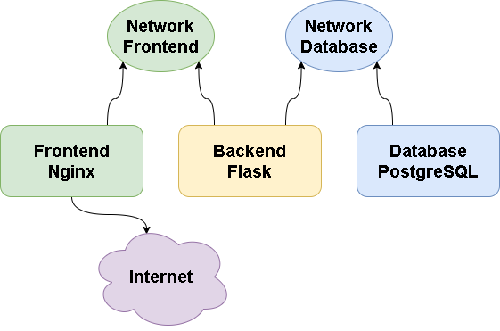
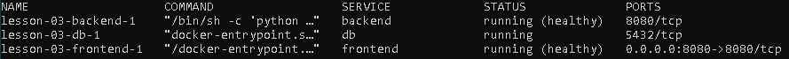

# DevOps Internship: Docker Task 3
## Hometask

Написать docker-compose.yaml, для всего проекта, собрать и запустить.

Критерий оценки финального задания:

1. Dockerfile должны быть написаны согласно пройденным best practices.
1. Для docker-compose необходимо использовать локальное image registry.
1. В docker-compose необходимо сетевые настройки 2 разных интерфейса(bridge):
    1. для фронта
    2. для бека с postgresql.

\* Осущиствить сборку проекта самим docker-compose команда docker-compose build (при использовании этого подхода необходимо исключить 2 пункт из критерии оценки).

## Solution

### Variables

Чтобы задать переменные необходимо создать в корне файл .env
```ENV
APP_PATH - Директория где будет располагаться приложение
APP_PORT - Порт на котором будет подыматься приложение
APP_MODE - Метод развёртывания production или development
POSTGRES_PASSWORD - Пароль для доступа к базе данных
COMPOSE_PROJECT_NAME - Наименование проекта
```
Пример .env файла
```ENV
APP_PATH=/app
APP_PORT=8080
APP_MODE=production
POSTGRES_PASSWORD=LOjihnrKISUd3did2d
COMPOSE_PROJECT_NAME=Lesson-03 # Данный параметр опциональный
```

### Description

1. Производится сборка для frontend
    * Копируется Single Page приложение (index.html) в директорию /usr/share/nginx/html
    * Заменяется конфиг Nginx /etc/nginx/conf.d/default.conf в котором добавлена location для доступа к backend
        ```nginx
        location /api {
            proxy_pass http://backend:{{ APP_PORT }}/;
            proxy_set_header X-Forwarded-For $proxy_add_x_forwarded_for;
            proxy_set_header X-Real-IP $remote_addr;
            proxy_set_header Host $host;
        }
        ```
    * Заменяются с помощью sed переменные в файлах index.html и default.conf
    * Устанавливается curl для использования healthcheck
2. Производится сборка для backend
    * Копируем в директорию $APP_PATH requirements.txt
    * Устанавливается curl для использования healthcheck
    * Отдельно устанавливаем модуль psycopg2-binary
    * С помощью pip устанавливаем зависимости из файла requirements.txt
    * Копируем исходный код приложения в директорию $APP_PATH
    * Определяем переменные окружения для корректного запуска приложения
        ```Enviroment
        ENV FLASK_APP=backend.py # определяем загрузочный файл
        ENV FLASK_ENV=$APP_MODE  # определяем режим запуска (production или development)
        ENV APP_PORT=$APP_PORT   # определяем порт на котором будет работать приложение
        ```
3. Запускаем образ в базой данных

### Scheme


## Result

